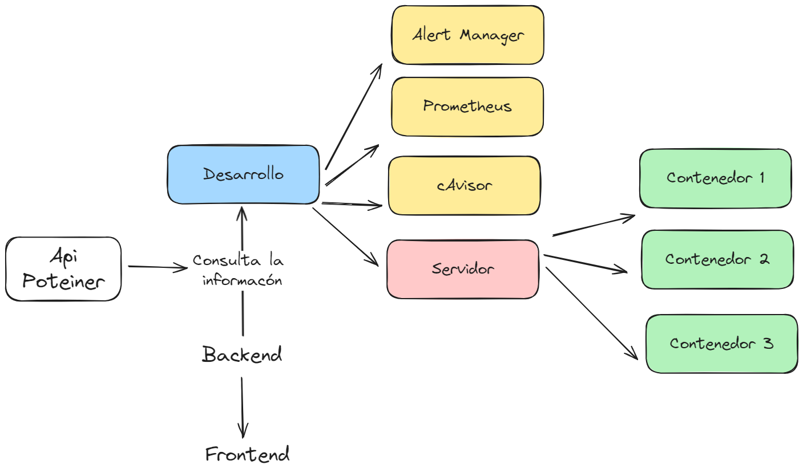

# Arquitectura del Proyecto:

En esta arquitectura, uso la api de Portainer dandome la información de los contenedores del servidor, como se muestra en la imagen. Desde el backend, realizamos consultas para obtener la información necesaria sobre el estado de los servidores, verificando si están activos o caídos. Esta información se refleja en el frontend para su visualización.

## Comandos del proyecto Back-end/Front-end:

- `yarn dev`: Incia el proyecto.
- `yarn`: Instala las dependecias necesarias para iniciarlo.
- `yarn add @example`: Instala una dependecia en específico.

## Comandos Docker:

- `docker compose pull`: Descarga las imágenes.
- `docker-compose up -d`: Crea y levanta las imágenes en segundo plano.
- `docker ps`: Verifica qué contenedores están en ejecución.
- `docker-compose ps`: Muestra los contenedores en ejecución de una forma más sencilla.

## Api Portainer:

- `https://portainer.example.com/api/endpoints`: Te trae información completa de los contenedores.